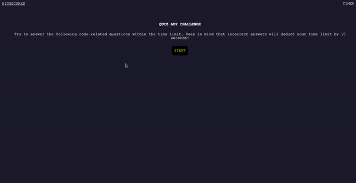

# code-quiz-app

## Description
This JavaScript Code Quiz app has 5 questions which are multiple choice. The questions are related to some basic coding questions about CSS, HTML & JavaScript. At the start of the page you are presented with instructions explaining how the user will be score. Once the app has started, you will be presented with the questions. Upon completion, the webpage will ask the user to input their initials in order to save their score and places it in Highscore Leaderboard page.

The webpage can be accessible through this link: https://darioelao.github.io/code-quiz-app/

## Webpage Preview

## Usage

* 1. Load the page
* 2. Click "START" button to start the quiz
* 3. Choose one the four options to answer the questions
* 4. Once all the questions are answered, or time runs out, you will be asked to input your initials to save    your score
* 5. When the "SUBMIT" button is clicked, you can check your score on the HighScore page
* 6. On the HighScore page, you can clear all your previous scores or rerun the Quiz by clicking "Go Back" button.
